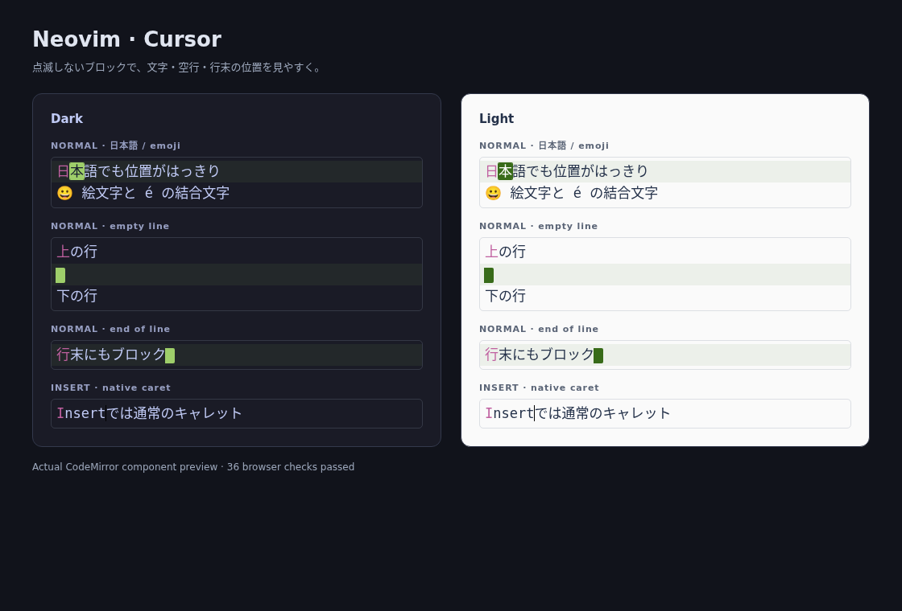
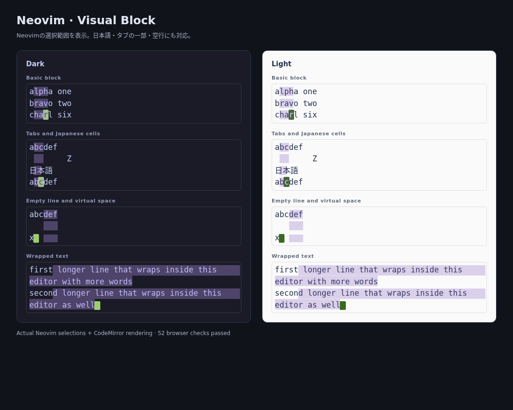

# Neovim for Obsidian

**0.0.6 — Beta**

An early desktop plugin that uses a **real local Neovim process** to edit notes in Obsidian, inspired by vscode-neovim. Obsidian keeps its Markdown editor and saves the notes. Neovim runs in the background and handles editing commands over MessagePack-RPC.

## Install

Requirements: desktop Obsidian **1.8.7+**, Neovim **0.9+**, and Node.js **22+** for development. Obsidian 1.13.7 and Neovim 0.12.5 are tested locally. Mobile is not supported.

Download `main.js`, `manifest.json`, and `styles.css` from the [0.0.6 release](https://github.com/m13yama/obsidian_nvim/releases/tag/0.0.6), then follow steps 2–5 below. Alternatively, extract `obsidian-neovim-0.0.6.zip` into `<your-vault>/.obsidian/plugins/`. Node.js is only needed when building from source.

1. Build the plugin in this folder:

   ```sh
   npm ci
   npm run build
   ```

2. Create `<your-vault>/.obsidian/plugins/obsidian-neovim/` and copy these three files into it:

   ```text
   main.js
   manifest.json
   styles.css
   ```

3. In Obsidian, turn off **Settings → Editor → Vim key bindings**. Enable community plugins, reload Obsidian, and enable **Neovim** in the community plugin list.
4. Open a Markdown note in editing mode. The status bar should show `NVIM NORMAL`.
5. If Obsidian cannot find Neovim, set **Settings → Neovim → Neovim executable** to its absolute path, then click **Restart Neovim**. GUI apps may have a different `PATH` from your terminal. Use `command -v nvim` on Linux/macOS or `where nvim` on Windows to find the path.

The three install files are already generated after `npm run build`; Node.js and `node_modules` are not needed in your vault.

To upgrade an existing installation, replace all three files, keep your existing `data.json`, and restart Obsidian. Version 0.0.3 fixes an error that could prevent earlier versions from unloading cleanly. See the configuration section below to enable your normal Neovim config when upgrading from 0.0.1.

## What works in this version

- Neovim normal, insert, replace, operator-pending, and keyboard visual editing.
- Motions, text objects, counts, registers, macros, dot repeat, undo (`u`), and redo (`Ctrl-R`) handled by Neovim.
- Neovim `/` and `?` searches and `:` commands, with a small command-line/message display in Obsidian.
- `:w` asks Obsidian to save the current note. Normal Obsidian autosave continues to work.
- Plain-text paste uses `nvim_paste`, so text such as `<Esc>` is inserted literally.
- Unicode conversion between Neovim’s UTF-8 byte columns and CodeMirror’s UTF-16 positions.
- A separate Neovim buffer for each editor, shared registers within the process, and synchronization of changes made through Obsidian.
- Your normal Neovim configuration, key mappings, and startup plugins load by default for new installations (see below for the 0.0.1 upgrade setting).
- **Neovim: Toggle Neovim** and **Neovim: Restart Neovim** commands. Clicking the status bar also restarts Neovim.
- If startup or the process fails, keyboard input returns to Obsidian and note text remains in the editor.

## Mode display

A Powerline-style status line in Obsidian’s status bar shows:

- Green for Normal, blue for Insert, purple for Visual/Select, pink for Replace, amber for Command, and orange for pending operators.
- The active note name, line/display column, and position within the document. The column accounts for tabs and wide characters.
- A `REC @q` indicator while recording a macro into register `q`.
- Distinct Ready, Starting, Off, and Offline states. Hover for the full note path and position; click the status line to restart Neovim.

Choose **Settings → Neovim → Status line style → Powerline / Compact**. The style changes immediately. Compact shows the mode, cursor position, and any macro recording indicator. Narrow windows automatically hide extra details. Both styles follow Obsidian’s light/dark backgrounds and work without a Nerd Font.


This is a standalone preview of the plugin’s actual display component.

## Cursor and shortcuts

Normal mode has a steady green block and a subtle current-line highlight. Empty lines and positions after line ends have a visible cursor cell without adding spaces to the note. The block follows character widths, keeps emoji/combining characters together, and becomes an outline when the editor loses focus. Insert, Replace, and IME composition retain the native caret.



This is a standalone preview of the actual CodeMirror component.

### Shortcut priority

Editor shortcuts are handled through Obsidian's view scopes, before application hotkeys. The routing applies inside the connected note editor. Dialogs, search fields, note titles, and file renaming keep their own shortcuts.

| Shortcut | Normal / Visual | Insert / Replace |
| --- | --- | --- |
| `Ctrl+V` | Blockwise Visual mode | Native paste |
| `Ctrl+A` / `Ctrl+X` | Vim increment / decrement | Native select-all / cut |
| `Ctrl+F` | Vim page forward | Obsidian find |
| `Ctrl+R` | Vim redo | Vim insert-register command |
| `Ctrl+S` / `Ctrl+C` / `Ctrl+P` | Obsidian save / copy / quick switcher | Same |
| `Ctrl+E` | Obsidian editing / reading view toggle | Same |
| `Ctrl+0` | Focus the left sidebar | Same |
| `Ctrl+Shift+…`, `Alt+…`, macOS `Cmd+…` | Obsidian / OS shortcuts | Same |

Other Ctrl keys go to Neovim. To avoid a collision with a Vim Ctrl command, assign your Obsidian command a Ctrl+Shift shortcut. In Normal mode, paste from a Vim register with `p`/`P`, use the context-menu Paste action, or enter Insert mode for native `Ctrl+V`. `Ctrl+C` remains copy; use `Esc` or `Ctrl+[` to leave Insert mode.

In editing view, `zz` centers the cursor line in Obsidian's editor in Normal and Visual modes. A count such as `50zz` moves to that line and centers it. Existing custom `zz` mappings take priority.

### Blockwise selection

`Ctrl+V` highlights the selected columns in purple. The range follows Neovim's selection, including reverse selections, Japanese text, emoji, combining characters, partial tabs, and the `selection` option. Virtual space on empty or short lines is highlighted when `virtualedit` allows it. Wrapped text is highlighted on each rendered line.

The highlight is a separate visual layer that does not add text or change the browser's selection. Use Neovim's `y` and `p`/`P` for blockwise copying and pasting. The highlight clears when you leave Visual/Select mode, the note changes through Obsidian, or Neovim disconnects.



This preview uses selections captured from a real Neovim process and rendered by the actual CodeMirror component.

### Reading view

With Neovim running, press `j` to scroll down or `k` to scroll up in Markdown reading view. Hold either key to keep scrolling. These keys work independently of the pane and sidebar navigation setting. Search fields, note titles, embedded editable controls, and dialogs keep their normal input behavior.

### Pane and sidebar navigation

**Settings → Neovim → Vim pane and sidebar navigation** is enabled by default. Restart Neovim after changing it. Existing custom Neovim mappings for the `Ctrl+W` sequences take priority. `Ctrl+0` is an Obsidian command shortcut and works independently of this setting.

| Shortcut | Action |
| --- | --- |
| `Ctrl+0` | Reveal and focus the left sidebar, including from editing and reading views |
| `Ctrl+W`, then `j` / `k` / `l` | Focus the adjacent Obsidian pane below / above / to the right; at the right edge, reveal the existing right sidebar |
| `Ctrl+W`, then `p` | Return to the most recently focused Markdown editor |
| File explorer: `j` / `k` | Move down / up |
| File explorer: `h` / `l` | Native left/right tree action: collapse / expand a folder, navigate the tree, or open a file |
| File explorer: `Enter` | Obsidian's native open action |
| File explorer: `a` / `Shift+A` | Create a note / folder in the focused folder (or the focused file's parent) |
| File explorer: `r` / `d` | Rename / delete the selection using Obsidian's native UI and trash settings |
| File explorer: `y` / `x` / `p` | Copy / cut / paste files and folders using the plugin's file clipboard |
| File explorer: `v` | Open the focused file in a pane to the right |
| File explorer: `Shift+R` | Refresh the file tree |
| Sidebar: `Esc` | Return to the editor |

Press Ctrl+W first, then the second key. In notes these are Normal-mode mappings; in sidebars the second key must follow within 1.5 seconds. The file explorer handles selection, folders, scrolling, and opening files through its existing keyboard behavior. Typing into sidebar search or rename fields does not trigger Vim navigation.

File operation keys follow [vscode-neovim's explorer bindings](https://github.com/vscode-neovim/vscode-neovim#explorer-file-manipulation-bindings). Creating a note opens Obsidian's native new-note UI; creating a folder starts inline renaming. Copy/cut supports the explorer's selection, including folders, and paste uses Obsidian's collision handling and link-aware moves. Holding an operation key does not repeat it. Obsidian automatically tracks vault changes; `Shift+R` refreshes the displayed tree. These aliases use the core file explorer's internal handlers and report an error if an Obsidian version does not expose the required operation.

The command **Neovim: Focus left sidebar** defaults to `Ctrl+0`; the plugin no longer assigns `Ctrl+W h` to any navigation action. You can change this shortcut or assign shortcuts to **Neovim: Focus right sidebar** and **Neovim: Focus editor** under **Settings → Hotkeys**. Sidebars must contain an enabled view, such as Files or Outline. Tree-key aliases currently target the file explorer; other sidebar views keep their own internal controls.

## Neovim configuration

New installations load your normal Neovim configuration by default. Leave **Custom init file** empty to use Neovim’s usual configuration discovery, including `init.lua`/`init.vim`, required Lua modules, `plugin/`, packages, `after/plugin/`, and filetype plugins. Neovim inherits the Obsidian process’s environment, including `NVIM_APPNAME` and XDG paths if present.

**Upgrading from 0.0.1:** that version defaults to clean mode. Existing saved preferences are preserved, so enable **Settings → Neovim → Load Neovim configuration**, then click **Restart Neovim**. New installations of 0.0.2 and newer start with this setting enabled.

For a custom configuration, set **Custom init file** to an `init.lua` or `init.vim`. Absolute paths and `~/` paths work. Its parent directory is added to Neovim’s runtime and package paths, so sibling `lua/`, `plugin/`, `pack/`, and `after/` files load too. Turn off **Load Neovim configuration** to start a clean Neovim when troubleshooting.

The UI attaches before configuration loads, and the bridge waits for `VimEnter` before opening notes. Startup plugins can detect the attached UI, and Markdown `FileType` hooks run in the note’s buffer. Editing options, clipboard preferences, and display options are preserved in Neovim; settings such as colorschemes, status lines, and line numbers do not automatically change Obsidian’s appearance.

### Detect startup from Obsidian

The plugin sets **`vim.g.obsidian = true`** (Vimscript: **`g:obsidian`**) in its Neovim process **before** `init.lua` or `init.vim` runs. Use it to choose Obsidian-specific settings or skip plugins that need Neovim’s own windows. No extra option needs to be enabled.

In `init.lua` or a required Lua module:

```lua
if vim.g.obsidian then
  -- Neovim was started by the Obsidian plugin.
  vim.keymap.set('i', 'jj', '<Esc>')
else
  -- Settings for other Neovim sessions.
end

-- Shared settings continue to load in every session.
vim.opt.ignorecase = true
vim.opt.smartcase = true
```

In `init.vim`:

```vim
if get(g:, 'obsidian', v:false)
  " Neovim was started by the Obsidian plugin.
  inoremap jj <Esc>
else
  " Settings for other Neovim sessions.
endif
```

For a lazy.nvim plugin that requires Neovim windows, use `cond = not vim.g.obsidian` in its plugin specification ([lazy.nvim condition documentation](https://lazy.folke.io/spec#spec-loading)). Keep your shared configuration outside the conditional so it still loads inside Obsidian. To check the flag in a running session, use `:echo get(g:, 'obsidian', v:false)`.

### Settings managed by the bridge

The plugin uses managed `acwrite` buffers named `obsidian://…`. These note buffers keep `bufhidden=hide`, `swapfile=false`, and `undofile=false`. The bridge enables `hidden`, disables `autowrite`/`autowriteall`, and starts with ShaDa disabled because Obsidian owns note paths and saving. Other user options are left intact. Restarting resets Neovim’s undo history and registers; it preserves text already synchronized to Obsidian.

## Current limits

The plugin integrates Neovim editing with Obsidian. UI and plugin compatibility still have the following limits.

- All ordinary typing, including insert-mode typing, goes through Neovim. Obsidian autocomplete, automatic bracket insertion, and other plugins’ key handlers may behave differently. Conflicting Obsidian shortcuts may need to be unbound.
- Use Obsidian to open, switch, and close notes. Your configured plugins load, but Neovim window/tab layouts, terminal buffers, floating windows, Telescope, completion menus, and `:edit`/`:split`/`:buffer` navigation are not integrated. Some plugins skip managed `acwrite` buffers or require file-read events that these virtual notes do not emit; loading a plugin does not guarantee it can attach to a note.
- Characterwise, linewise, and blockwise Visual selections are displayed. Live Preview can hide Markdown syntax that has no visible text to highlight. Mouse selection is synchronized as a cursor position; use `v`/`V`/`Ctrl+V` for visual editing.
- In editing view, `j`/`k` operate on document lines. The Neovim window size is estimated from the editor, so wrapped-line motions, folds, and scrolling do not exactly match Obsidian’s Live Preview layout.
- Clipboard shortcuts depend on the mode; see the shortcut table above. Cmd shortcuts stay with Obsidian. Vim registers are separate from native clipboard operations.
- IME composition is left to CodeMirror and synchronized after composition commits. Japanese IME, dead-key layouts, and pop-out windows need manual verification in Obsidian. The command-line display currently lives in the main window.
- Changes synchronize as one minimal text replacement. Large notes are not optimized yet. If a separate plugin edits a note while Neovim input is still in flight, the newer host revision takes priority; this can discard the pending Neovim edit. Split panes for the same note rely on Obsidian propagating changes between editors.

## Development

```sh
npm run dev        # rebuild main.js when source files change
npm run typecheck  # TypeScript checks
npm test           # unit tests and real Neovim integration tests
npm run check      # production build plus all tests
```

Set `NVIM_BIN=/absolute/path/to/nvim` when running tests if necessary. Tests require Neovim; they do not silently skip it. Reload the plugin in Obsidian after rebuilding.

### Architecture

```text
Obsidian / CodeMirror 6
  ↕ keystrokes, note changes, cursor/selection updates
Editor controller (ordered work queue, revision checks)
  ↕ MessagePack-RPC over stdin/stdout
Local nvim --embed
  ↕ Lua callbacks
Managed note buffers, modes, registers, mappings, undo
```

- `src/editor/`: CodeMirror extension, keyboard translation, Unicode positions, and process coordination.
- `src/neovim/`: process/RPC transport, session API, and the Lua bridge.
- `src/main.ts`: Obsidian lifecycle, settings, status, and save integration.
- CodeMirror and Obsidian are external to the bundle so the plugin uses Obsidian’s own editor classes.

### Manual smoke test

Use a scratch note for the first desktop test:

1. Type `ihello<Esc>`, then try `dw`, `u`, `Ctrl-R`, `ciw`, `.`, and `yy`/`p`.
2. Try `v`, `V`, `/hello`, `:%s/hello/world/g`, and `:w`.
3. Type Japanese text and emoji, move across them, and paste multiline text containing `<Esc>`.
4. Switch notes, open the same note in two panes, and edit through another Obsidian command.
5. Restart/toggle the plugin and try an invalid executable path; the note must remain editable.
6. Enable your normal config and verify its mappings, indentation, and search options. Repeat with a custom config that requires sibling Lua modules.
7. Check the cursor on Japanese text, emoji, empty lines, and line ends in light/dark themes. Switch panes, use IME, and toggle Neovim to check caret restoration.
8. Use `Ctrl+V`, `j`, `l` on a scratch note and verify that the highlighted columns follow the selection; delete with `d` and undo with `u`. Repeat across Japanese text, tabs, and empty lines. Verify native `Ctrl+V` still pastes in Insert mode, and `Ctrl+E` still switches editing/reading views. Check save, copy, quick switcher, and command palette shortcuts too.
9. Use `Ctrl+0` to focus Files from editing and reading views, navigate with `h/j/k/l`, open a note with `Enter`, and return with `Esc`. Check that `Ctrl+W h` does not move between panes or collapse folders, and that renaming/search fields and dialogs accept ordinary typing.
   In a scratch folder, try `a` / `Shift+A` to create a note / folder, `r` to rename, `y` / `x` / `p` to copy / move, `v` to open to the right, and `d` to delete through the normal confirmation UI. Verify operations use the focused tree item, and canceling deletion preserves the file.
10. Switch a long note to reading view with `Ctrl+E`. Use `j` / `k`, including holding either key, to scroll down / up. Check that search fields and dialogs accept ordinary typing, close the note search and verify scrolling resumes, then switch back to editing and verify normal Vim motions. In editing view, use `zz` and `50zz` to center the cursor line; repeat after scrolling with the mouse and in Visual mode.

### API references

- [Obsidian editor extensions](https://docs.obsidian.md/Plugins/Editor/Editor+extensions)
- [Accessing Obsidian’s CodeMirror editor](https://docs.obsidian.md/Plugins/Editor/Communicating+with+editor+extensions)
- [Neovim API and RPC](https://neovim.io/doc/user/api/)
- [Neovim external UI events](https://neovim.io/doc/user/api-ui-events/)
- [Neovim startup and configuration discovery](https://neovim.io/doc/user/starting/)
